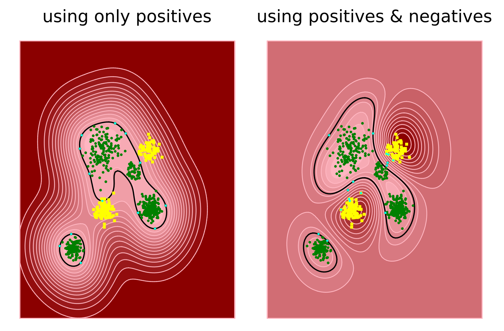

# MKSVDD.jl

Support Vector Data Description (SVDD) model for unary or binary classification, which is mainly used for abnormal detection.

## Installation

```julia
using Pkg

# if not registered
Pkg.add(url="https://github.com/sonosole/MKSVDD.jl")

# if registered
Pkg.add("MKSVDD")
```

## Main Features

+ unary classification with only normal datas
+ binary classification with both positive and negative datas
+ multi-kernel functions suffixed with K
  + ChebyK
  + CityK
  + CosK
  + EucK
  + HammingK
  + JaccardK
  + KLDivK
  + MAEK
  + MSEK
  + MinkowskiK
  + NRMSEK
  + RBFK
  + RMSEK

## APIs

### Unary Classification Case

```julia
SVDD(kernel::K, x::Matrix, C::Real, ϵ::Real=1e-3) where {K <: XKernel}
```

of which, `x` is the normal data,  `C` is the penalty coefficient (the bigger the less error allowed), lagrange multipliers below the threshold `ϵ` will be discarded.

### Binary Classification Case

#### Having Labels Explicitly

```julia
SVDD(kernel::K, x::Matrix, y::Vector{Int}, C::Real, ϵ::Real=1e-3) where {K <: XKernel}
```

of which, `x` is the  data with label `y`,  `C` is the penalty coefficient (the bigger the less error allowed), lagrange multipliers below the threshold `ϵ` will be discarded. Note that positive samples are labeled with +1, while the negative samples are labeled with -1. The function:

```julia
svddlabel(num_of_pos::Int, num_of_neg::Int)::Vector{Int}
```

could be a helper to make labels.

#### Having Labels Implicitly

```julia
SVDD(kernel::K, xpos::Matrix, xneg::Matrix, C::Real, ϵ::Real=1e-3) where {K <: XKernel}
```

of which, `xpos` is the normal data and `xneg` is the abnormal data,  `C` is the penalty coefficient (the bigger the less error allowed), lagrange multipliers below the threshold `ϵ` will be discarded.

## Example

Let's prepare a plotting function

```julia
using Plots

# plot only positives
function plotit(model::SVDD, xp::Matrix{T}, b::Real, k::String) where T
    r = T.(range(-b, b, length = 100))
    xy = hcat([[x,y] for x ∈ r for y ∈ r]...)
    z = model(xy)
    Z = reshape(z, length(r), length(r))
    contourf(r, r, Z, color=:reds, title="$k")
    contour!(r, r, Z, levels=[0], linewidth=1.5, color=:black, cbar=false, legend=false)
    scatter!(xp'[:, 1], xp'[:, 2], color = :green, markershape=:circle, markersize=1.8, markerstrokewidth = 0)
    scatter!(model.svecs[1,:], model.svecs[2,:], color=:cyan, marker=1, markerstrokewidth = 0)
end

# plot positives and negatives
function plotit(model::SVDD, xp::Matrix{T}, xn::Matrix{T}, b::Real, k::String) where T
    r = T.(range(-b, b, length = 100))
    xy = hcat([[x,y] for x ∈ r for y ∈ r]...)
    z = model(xy)
    Z = reshape(z, length(r), length(r))
    contourf(r, r, Z, color=:reds, title="$k")
    contour!(r, r, Z, levels=[0], lw=1.5, color=:black, cbar=false, legend=false)
    scatter!(xp'[:, 1], xp'[:, 2], color = :green, markershape=:circle, markersize=1.8, markerstrokewidth = 0)
    scatter!(xn'[:, 1], xn'[:, 2], color = :yellow, markershape=:rect, markersize=1.8, markerstrokewidth = 0)
    scatter!(model.svecs[1,:], model.svecs[2,:], color=:cyan, marker=1.5, markerstrokewidth = 0)
end
```

then create some dummy 2-D data

```julia
begin
    xp = hcat(0.9rand(2, 50), 
              0.3randn(2, 199) .+ [1.5;-1.5], 
              0.6randn(2, 150) .+ [-1.5;1.5],
              0.3randn(2, 112) .- [3.5;3.5]);
    x1 = 0.3randn(2, 90) .- [1.5;1.5]
    x2 = 0.3randn(2, 73) .+ [1.5;1.5]
    xn = hcat(x1, x2)
end
```

finaly fit the data and show the effect

```julia
begin
    C  = 15.5       # penalty coefficient
    kf = RBFK(1.3)  # gaussian kernel

    # only using positive samples
    model = SVDD(kf, xp, C)
    plt1 = plotit(model, xp, xn, 7, "using only positives")

    # using both positives and negtives
    model = SVDD(kf, hcat(xp,xn), svddlabel(size(xp,2), size(xn,2)), C)
    plt2 = plotit(model, xp, xn, 7, "using positives & negatives")

    plot(plt1, plt2, layout=(1,2), axis=nothing, framestyle=:none)
end
```



where the black line is the contour with a value of zero, the green dots are positive samples inside the ball, the yellow squares are negtive samples outside the ball, the cyan dots are support vectors.

## NOTICE

`Float16` data type is not enough, it causes problem

> ERROR: Objective function is not convex.

So use `Float32` or `Float64` instead.